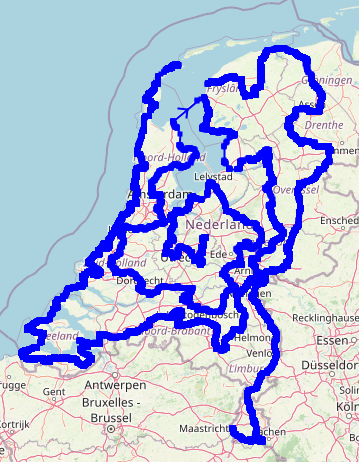

# README – Richtlijnen voor Aanpassingen aan de Spiraalpad-route

Welkom bij het Spiraalpad project! Deze route van circa 3000 km slingert in een spiraal van Amersfoort naar Maastricht en verbindt de belangrijkste culturele, natuurlijke en historische plekken van Nederland.

Deze README beschrijft de regels en uitgangspunten die gehanteerd worden bij het aanpassen, uitbreiden of optimaliseren van de route. Het doel is om consistentie, kwaliteit en de missie van het Spiraalpad te waarborgen.

## MUST: Verplichte componenten en regels

- Start: Amersfoort
- Einde: Maastricht
- Verplichte POI’s (Points of Interest)
- Alle 12 provinciehoofdsteden
- Alle UNESCO Werelderfgoederen in Nederland (9)

## Routeprincipes

- Route blijft volledig binnen Nederland (geen grensoverschrijdingen)
- Route mag slingeren, maar vermijdt onnodig teruglopen
- Paden mogen elkaar niet kruisen
- Beeld boven verhaal: visueel interessante of kenmerkende plekken hebben voorrang
- In steden: voorkeur voor bezienswaardigheden (monumenten, architectuur, kunst)
- Buiten steden: voorkeur voor off-road wandelpaden
- Vermijd fietspaden, wandelaars en fietsers verdragen zich slecht
- De route kruist nooit, en geen heen en weertjes

## Sterk aanbevolen

- Steden met stadsrechten (meer dan 190)

- Natuurmonumenten (meer dan 300)

- In steden: langs rijksmonumenten, architectuur, kunstwerken

- Buiten steden: natuurgebieden en stilteplekken

- Gebruik van OV-verbonden steden als etappegrenzen

- Alle UNESCO kandidaten (5)

- Alle UNESCO voormalige kandidaten (8)

## Te vermijden

- Grensoverschrijdende uitstapjes (ook niet naar België of Duitsland)

- Lelijke industrieterreinen tenzij functioneel of typerend

## Etappe-regels

- Lengte: 20-30 km per etappe

- Start- en eindpunt: in of nabij een stad met OV-aansluiting

- Indien mogelijk start en eind in een herkenbare kern of POI

## Bronnen en lijsten

- Nationale Parken in Nederland

- UNESCO Werelderfgoed Nederland

- Steden met stadsrechten

- Natuurmonumenten overzicht

Bijdragen aan de route zijn welkom! Volg deze richtlijnen bij het aanleveren van GPX-wijzigingen, POI’s of etappevoorstellen. Voeg altijd beknopte uitleg toe bij je commit of pull request.

